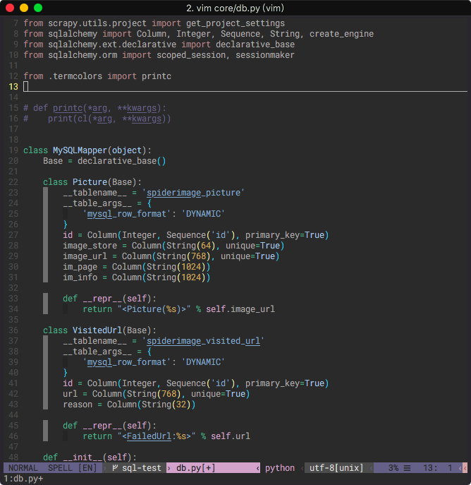

Vim colorscheme **concerto**
============================

This colorscheme is moditied from another scheme named Peaksea and currently finished
 the terminal 256 colors of the dark background part.

Installation
------------

Basic install - very simple (\*nix or cygwin install)

    mkdir ~/.vim
    git clone https://github.com/dannyvi/vim-colorscheme.git ~/.vim

if you [use vim + pathogen](http://vimcasts.org/episodes/synchronizing-plugins-with-git-submodules-and-pathogen/)

    cd ~/.vim
    git submodule add https://github.com/dannyvi/vim-colorscheme.git bundle/colorschemes

if you [use vim + vundle](https://github.com/gmarik/vundle)
- add to `.vimrc`:

        Plugin 'dannyvi/vim-colorscheme'
    
- then Inside the vim:

        :PluginInstall

if you aren't so clever just get all the files in `colors/*.vim` into
  `~/.vim/colors`

    # after downloading; unpacking; cd'ing
    cp colors/* ~/.vim/colors

Using
-----

To change the colorscheme of Vim, add to your `.vimrc`:

    colorscheme concerto

Inside Vim, you use:

    :colorscheme molokai

See
---

- - -
